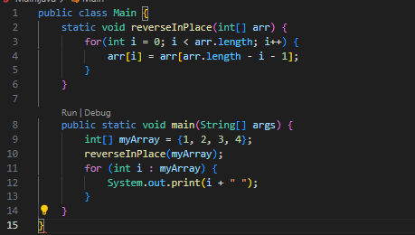
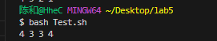
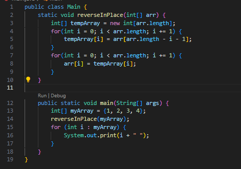
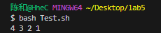
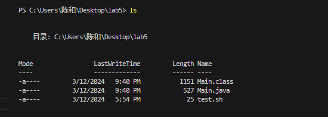
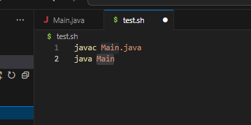

# Lab Report 5 - Putting it All Together (Week 9)
## Part 1 – Debugging Scenario
## Original Post: 
Hello, 
I’m experiencing an issue when trying to reverse an array of integers in Java. 
My method reverseInPlace is supposed to reverse the array in place, but the output isn’t what I expected. Initially, I thought my loop or swap logic might be the issue, but I'm not sure what's wrong.
Here's the part of the code that's giving me trouble:
* Error code

* Error of output

I expected to see `[4, 3, 2, 1]`, but that's not what's happening. Any thoughts on what might be causing this and how I can fix it?
## Response from TA:
Hi,

The logic in your reverseInPlace method seems to have a common mistake. 
You are trying to swap the elements within the same loop, which is causing the first half of the array to overwrite the second half.
To better understand what's happening during each iteration, can you add print statements after the assignment inside your loop? 
This will show us the state of the array at each step and help us pinpoint the error.

## Follow UP:
Thanks to your advice, I added print statements and discovered the problem! The array was being modified during the iteration,
which led to incorrect results. I have revised the method as follows:
* New method:

* New output:

Now, when I run the program with the same input array, it correctly outputs the reversed array `[4, 3, 2, 1]`. Thanks again for your help!

## File and Directory Structure: 
`Lab5` Folder with `Main.java` and `test.sh` files

## Contents before fixing:
* `Main.java`

* `test.sh`

## Command to Trigger the Bug:
`bash Test.sh` 

## Description of what to edit to fix the bug:
Replace the original loop in the reverseInPlace method with the revised method shown in the follow-up post. 
This fixes the issue by first copying the elements to a temporary array in reversed order and then copying them back to the original array.
This example showcases a debugging scenario from identifying a logical error in a Java method to testing and implementing a solution, 
while also reflecting on the student's learning experience with scripting and text editing.

# Part2 - reflection:
Reflecting on the recent weeks of the course, my understanding of software development has been profoundly expanded. During the time, Scripting, in particular, allowed me to automate repetitive tasks, which was a game-changer for my productivity. It was a sort of magic to see how a few lines of script could save hours of manual work. In Week 7, the challenge was to operate entirely from the command line, which was daunting at first. However, with the use of Vim, I discovered a powerful tool for editing code directly from the terminal. Vim's modal nature and keyboard shortcuts seemed esoteric at first, but with practice, they enabled me to edit files with efficiency I had not experienced before. I no longer rely on the crutch of a graphical interface, which is liberating. Week 8's exploration of debuggers and process control has equipped me with the skills to dissect complex issues methodically. Understanding how to control processes and utilize debuggers has given me a deeper insight into the software's execution flow. Together, these tools and techniques have given me a new level of command over my development environment, which is exhilarating. They've prepared me not just to write code, but to craft software with precision and insight.
